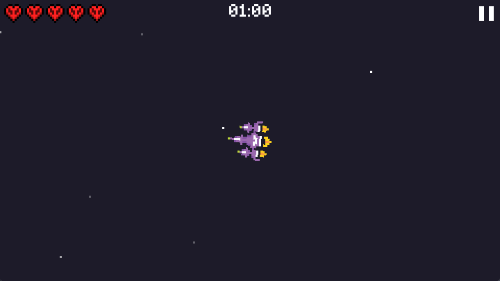
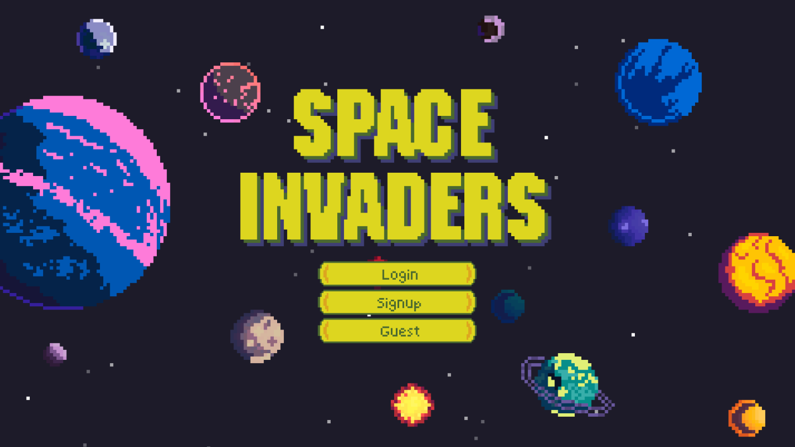
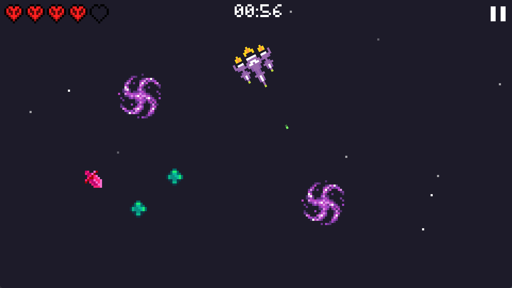
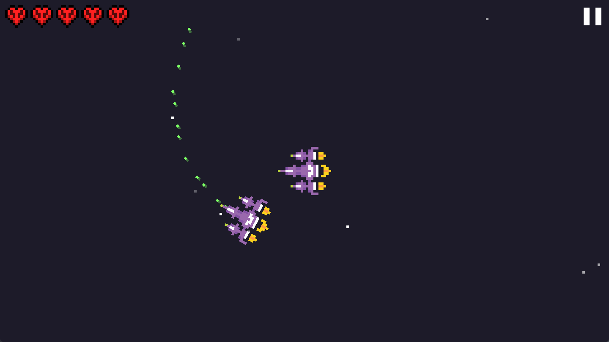
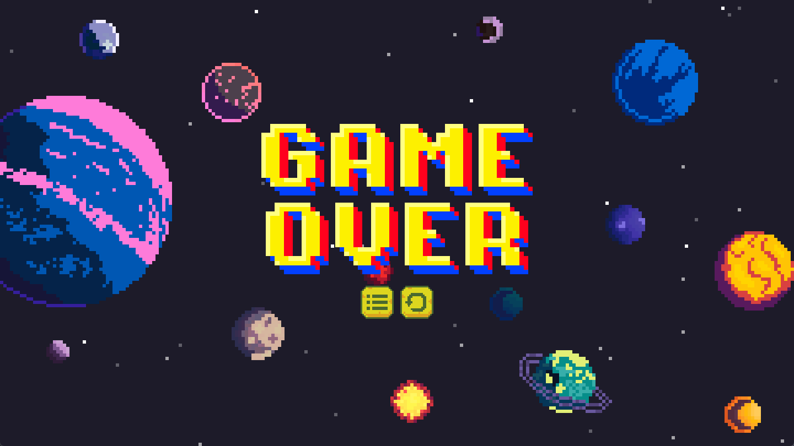
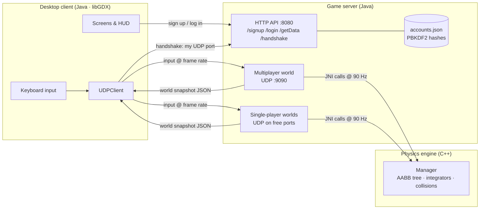

# Nebula's Edge


A multiplayer space shooter inspired by *Space Invaders*, built in 2024 by a team of six students. We wrote all of it ourselves, before AI coding tools: a **Java/libGDX** client, a **C++ physics engine** called from Java over **JNI**, a **UDP game server** that runs the simulation authoritatively, and **pixel art drawn by hand** for every sprite.

<p align="center">
  
</p>

<p align="center">
  
  
  <br>
  
  
</p>

## What we built

| Area | Highlights |
| --- | --- |
| **C++ physics engine** (`src/main/native`) | Written from scratch: integer fixed-point maths (velocities ×1000, angles in tenths of a degree, precomputed sin/cos tables), a dynamic **AABB tree** for broad-phase collision, double-dispatch narrow-phase collision with elastic responses, several integrators (velocity Verlet, standard Verlet, Beeman, leap-frog), black-hole gravity wells, homing enemies, timed power-ups, and a wrap-around world. |
| **JNI bridge** (`src/main/java/com/physics/Manager.java`, `Manager_JNI.cpp`) | The Java server owns a pointer to a native `Manager`. It spawns objects, sends player input, and reads world snapshots back as `int[][]`. |
| **Game server** (`server/`) | A Java HTTP API for accounts and the join handshake, plus UDP game worlds running a **90 Hz** simulation. There is one shared multiplayer world, and every single-player game gets its own private world on a free port. Clients send input; the server simulates and streams snapshots back, so it's the single source of truth. |
| **Desktop client** (`client/`) | libGDX/LWJGL3 with 13 screens: login, signup, menus, options, pause, game over, victory. It also has a camera that follows your ship, a parallax starfield, a health bar, a countdown timer, music, and sound effects. |
| **Art and audio** (`client/assets`) | Every sprite is hand-drawn pixel art: ships, 12 enemy designs, 21 asteroids, 14 planets, black holes, power-ups, hearts, buttons, and title cards. |

## How it fits together



One frame of multiplayer:

1. The client sends its input (`FORWARD`, `LEFT`, `BULLET`, …) over UDP, from a socket it registered during the HTTP handshake. Packets from unregistered addresses are dropped.
2. The server's game thread applies everyone's latest input to the C++ world through JNI, then steps the physics.
3. It reads every object's position and angle back, packs them into a snapshot (ships, enemies, asteroids, bullets, black holes, power-ups), and the network thread sends each player their copy.
4. The client draws the snapshot. Positions are in engine units (10 per on-screen pixel), and the camera centres on the player's ship.

## Quick start

**You need:** JDK 17 or newer (21 recommended) and a 64-bit C++ compiler. Gradle is downloaded automatically.

| OS | Compiler |
| --- | --- |
| Windows | [MSYS2](https://www.msys2.org/), then `pacman -S mingw-w64-x86_64-gcc`, then add `C:\msys64\mingw64\bin` to `PATH` |
| macOS | `xcode-select --install` (clang++) |
| Linux | `sudo apt install g++` (or your distro's equivalent) |

**1. Start the server.** It compiles the C++ engine on the first run, which takes about a minute.

```bash
cd server
./gradlew run          # Windows: .\gradlew.bat run
```

**2. Start the game** in a second terminal.

```bash
cd client
./gradlew lwjgl3:run   # Windows: .\gradlew.bat lwjgl3:run
```

**3. Play.** Click **Guest** (or sign up, which takes a few seconds), then choose **SinglePlayer** or **MultiPlayer**.

| Key | Action |
| --- | --- |
| `W` | Thrust forward |
| `S` | Cut thrust |
| `A` / `D` | Rotate left / right |
| `Space` | Shoot |
| `Esc` | Pause |
| `F12` | Save a screenshot to `client/screenshots/` |

**Single player:** survive 60 seconds. Asteroids and meteors chip away at your health, a homing enemy hunts you down, and black holes pull you in and destroy you if you get too close. Green power-ups heal you, pink ones boost your bullets, and orange ones multiply your score.

**Multiplayer:** everyone shares one persistent world, and each player brings their own homing enemy. Watch out for other players' bullets.

### Multiplayer across computers

Run the server on one machine. It prints the address other players should use:

```text
INFO  Players on your network can connect to 192.168.1.20 (client: ./gradlew lwjgl3:run -Pserver=192.168.1.20)
```

Then each player runs:

```bash
cd client
./gradlew lwjgl3:run -Pserver=192.168.1.20
```

The `NEBULA_SERVER` environment variable works too. Allow TCP 8080 and UDP 9090 (plus UDP for the single-player worlds) through the host's firewall. Several clients on the same computer also work, since each one picks its own UDP port.

### Troubleshooting

- **"Cannot reach the game server" in game:** the server isn't running, or `-Pserver` points at the wrong address.
- **`'g++' targets i686 (32-bit)`:** a 32-bit MinGW is earlier on your `PATH`. Put the 64-bit one first, or pass `-Pcxx=C:/msys64/mingw64/bin/g++.exe`.
- **`Unsupported class file major version`:** Gradle 8.14 runs on JDK 17–24. Point `JAVA_HOME` at a JDK in that range.

## Repository layout

```text
.
├── client/                    libGDX desktop game
│   ├── core/                  screens, HUD, rendering, networking (UDPClient, AuthenticationManager)
│   ├── lwjgl3/                desktop launcher
│   └── assets/                hand-drawn textures, fonts, music, sound effects
├── server/                    Java game server
│   └── src/main/
│       ├── java/org/spaceinvaders/   HTTP handlers, UDP worlds, accounts, GameEngine (JNI wrapper)
│       └── resources/gameConstants.json   tunable world size, radii, masses, speeds
├── src/main/native/           C++ physics engine and JNI bindings
├── src/main/java/com/physics/ Java side of the JNI bridge
├── physics-engine/            early stand-alone prototype of the engine, rendered with SFML
├── test/                      native integration test (make test)
├── docs/                      screenshots, ClientJavadoc/, ServerJavadoc/
└── Makefile                   stand-alone native build + test (the server's Gradle build doesn't need it)
```

## Development

| Command | Where | What it does |
| --- | --- | --- |
| `./gradlew run` | `server/` | Builds the C++ library (`buildNative`) and starts the server |
| `./gradlew buildNative` | `server/` | Only compiles the physics engine into `server/build/native/` |
| `./gradlew javadoc` | `server/` | Server API docs |
| `./gradlew lwjgl3:run` | `client/` | Starts the game (`-Pserver=<host>` to pick a server) |
| `./gradlew lwjgl3:jar` | `client/` | Runnable fat jar in `client/lwjgl3/build/libs/` |
| `make test` | repo root | Builds the engine with `make` and runs `test/TestPhysicsEngine.java` against it |

Game balance lives in `server/src/main/resources/gameConstants.json` and the level layout in `GameEngine.instantiateGameEngineObjects()`. Accounts are stored in `server/data/accounts.json`, which is git-ignored.

## 2026 revival notes

We never captured the game running in 2024, so this repo was brought back to life two years later:

- **Firebase was retired.** The project's Firebase database had been deactivated, and the game constants, server address, and logins all came from it. The server now keeps its own accounts (salted PBKDF2 hashes in a JSON file), the constants ship in `gameConstants.json`, and the client connects to `localhost` by default or to `-Pserver=<host>`.
- **Networking fixes:** the handshake added on the last day was never called by the client, so the server dropped every packet. Clients now register their UDP port during the handshake. They also no longer collide on a fixed UDP port, single-player games no longer clash with the multiplayer port, and dead players no longer silently respawn.
- **Engine fixes:** use-after-free crashes when a player died (enemies, bullets, and power-ups kept raw pointers to the freed ship), a Windows-only JNI type mismatch, timers shared across game worlds, and a short invulnerability window so one long meteor overlap doesn't drain all your health.
- **Client fixes:** new games start fresh instead of reusing the finished one, Restart buttons work, and the Pause screen keeps keyboard and mouse input after Restart. Victory can no longer turn into Game Over.
- **Build:** the server's Gradle build compiles the C++ engine itself (no `make` needed), there's a one-command start on every OS, and the project targets Java 17.

The original repository is [AbhirathA/Nebula-s-Edge](https://github.com/AbhirathA/Nebula-s-Edge).

## Team

Aryan · Gathik · Abhirath · Ibrahim · Jayant · Dedeepya
